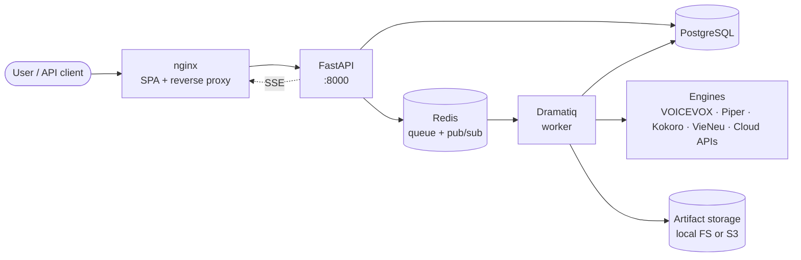

# ntd_audio

> [Tiếng Việt](README.vi.md) · English

A self-host-first **TTS orchestration platform**: queue voice synthesis jobs across multiple engines (cloud and open-source), monitor them in a live dashboard, and assemble the resulting audio into project-level masters.

> **For AI agents:** open [`AGENTS.md`](AGENTS.md). It defines the invariants you must respect.
>
> **For humans:** the [Quickstart](#quickstart) gets you running in under 5 minutes. Deeper docs are under [`docs/en/`](docs/en/).

## Why ntd_audio

- **Multi-engine in one place.** Cloud (OpenAI, ElevenLabs, Google Cloud TTS, Azure Speech) and open-source (VOICEVOX, Piper, Kokoro, VieNeu-TTS) behind one queue, one API, one UI.
- **Project-centric.** Jobs, voices, defaults, and assembled masters all hang off a `project`. Switching engines doesn't fragment your work.
- **Real-time UI.** SSE pushes job state changes sub-second; no manual refresh.
- **Self-host without PaaS.** One Docker Compose command. Postgres + Redis included. Production overlay strips host port bindings and the Docker socket.
- **Operational defaults.** Migrations gate the API. Healthchecks, stale-job reaper, rate limit, Prometheus metrics, encryption-at-rest for provider secrets, and structured logs all ship in the box.

## Architecture at a glance



Full topology and sequence diagrams: [`docs/en/architecture.md`](docs/en/architecture.md).

## Quickstart

```bash
git clone https://github.com/truongqv12/ntd_audio
cd ntd_audio
cp .env.example .env
docker compose up --build
```

- Frontend: <http://localhost:5173>
- API: <http://localhost:8000> · Swagger UI: <http://localhost:8000/docs>
- Health: <http://localhost:8000/health>

The default stack runs `migrate → api + worker → frontend` against bundled Postgres and Redis. To bring up an OSS engine alongside, use one of the Compose overlays:

```bash
# Run all OSS engines (VOICEVOX + Piper + Kokoro + VieNeu)
docker compose -f docker-compose.yml -f docker-compose.oss.yml up --build

# Or one engine at a time
docker compose -f docker-compose.yml -f docker-compose.piper.yml up --build
docker compose -f docker-compose.yml -f docker-compose.kokoro.yml up --build
docker compose -f docker-compose.yml -f docker-compose.vieneu.yml up --build

# GPU (VOICEVOX only)
docker compose -f docker-compose.yml -f docker-compose.gpu.yml up --build
```

For production, layer `docker-compose.prod.yml` on top — see [`docs/en/self-hosting.md`](docs/en/self-hosting.md).

## Where to go next

| You want to... | Read this |
|---|---|
| Understand the system | [`docs/en/architecture.md`](docs/en/architecture.md) |
| Deploy on your own server | [`docs/en/self-hosting.md`](docs/en/self-hosting.md) |
| Operate it day-to-day (backup, migrate, monitor) | [`docs/en/operations.md`](docs/en/operations.md) |
| Hack on the code | [`docs/en/development.md`](docs/en/development.md) |
| Use the HTTP API | [`docs/en/api.md`](docs/en/api.md) |
| Understand the database | [`docs/en/database.md`](docs/en/database.md) |
| See which engines are supported and how | [`docs/en/providers.md`](docs/en/providers.md) |
| See what features exist (and what's planned) | [`docs/en/feature-map.md`](docs/en/feature-map.md) |
| Understand the UI/UX rules | [`docs/en/design-system.md`](docs/en/design-system.md) |
| Contribute | [`CONTRIBUTING.md`](CONTRIBUTING.md) · [`AGENTS.md`](AGENTS.md) for AI assistants |

## Tech stack

| Layer | Tech |
|---|---|
| Frontend | React 18 · TypeScript · Vite · Vitest · ESLint · Prettier |
| Backend | FastAPI · SQLAlchemy 2 · Alembic · Pydantic v2 · Dramatiq · Ruff · Black · Mypy · pytest |
| Data | PostgreSQL 16 · Redis 7 |
| Storage | Local FS (default) · S3 / MinIO / R2 (optional) |
| Engines | VOICEVOX · Piper (`piper-tts`) · Kokoro (`kokoro`) · VieNeu-TTS (`vieneu`) · OpenAI · ElevenLabs · Google Cloud TTS · Azure Speech |
| Ops | Docker Compose · Prometheus exporter · GitHub Actions CI · pre-commit |

## License

[MIT](LICENSE).
