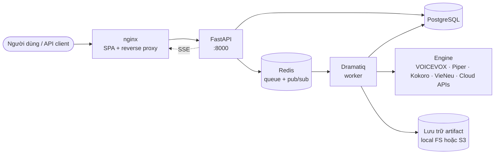

# ntd_audio

> Tiếng Việt · [English](README.md)

Nền tảng **điều phối TTS ưu tiên self-host**: xếp hàng các job tổng hợp giọng nói qua nhiều engine (cloud và mã nguồn mở), theo dõi trên dashboard thời gian thực, và ghép audio kết quả thành master theo project.

> **Dành cho AI agent:** mở [`AGENTS.md`](AGENTS.md). File đó định nghĩa các quy tắc bất biến cần tuân thủ.
>
> **Dành cho người đọc:** [Quickstart](#quickstart) chạy được trong dưới 5 phút. Tài liệu chi tiết nằm trong [`docs/vi/`](docs/vi/).

## Vì sao chọn ntd_audio

- **Đa engine trong một chỗ.** Cloud (OpenAI, ElevenLabs, Google Cloud TTS, Azure Speech) và mã nguồn mở (VOICEVOX, Piper, Kokoro, VieNeu-TTS) chia sẻ chung một queue, một API, một UI.
- **Lấy project làm trung tâm.** Job, voice, default, master ghép — tất cả gắn với một `project`. Chuyển engine không làm phân mảnh dữ liệu công việc.
- **UI thời gian thực.** SSE đẩy thay đổi trạng thái job dưới một giây; không cần F5 thủ công.
- **Self-host không cần PaaS.** Một câu lệnh Docker Compose. Đã bao gồm Postgres + Redis. Overlay production tự động bỏ binding host port và Docker socket.
- **Mặc định vận hành tốt.** Migration chặn API khi schema lệch. Healthcheck, reaper job treo, rate limit, metric Prometheus, mã hóa secret provider khi lưu, log có cấu trúc — tất cả đã có sẵn.

## Sơ đồ kiến trúc tổng quan



Topology đầy đủ và sequence diagram: [`docs/vi/architecture.md`](docs/vi/architecture.md).

## Quickstart

```bash
git clone https://github.com/truongqv12/ntd_audio
cd ntd_audio
cp .env.example .env
docker compose up --build
```

- Frontend: <http://localhost:5173>
- API: <http://localhost:8000> · Swagger UI: <http://localhost:8000/docs>
- Health: <http://localhost:8000/health>

Stack mặc định chạy `migrate → api + worker → frontend` cùng Postgres và Redis đi kèm. Để bật thêm OSS engine, dùng một overlay Compose:

```bash
# Bật tất cả OSS engine (VOICEVOX + Piper + Kokoro + VieNeu)
docker compose -f docker-compose.yml -f docker-compose.oss.yml up --build

# Hoặc từng engine
docker compose -f docker-compose.yml -f docker-compose.piper.yml up --build
docker compose -f docker-compose.yml -f docker-compose.kokoro.yml up --build
docker compose -f docker-compose.yml -f docker-compose.vieneu.yml up --build

# GPU (chỉ áp dụng cho VOICEVOX)
docker compose -f docker-compose.yml -f docker-compose.gpu.yml up --build
```

Khi triển khai production, xếp chồng `docker-compose.prod.yml` lên trên — xem [`docs/vi/self-hosting.md`](docs/vi/self-hosting.md).

## Đọc tiếp ở đâu

| Mục tiêu | Đọc file |
|---|---|
| Hiểu hệ thống | [`docs/vi/architecture.md`](docs/vi/architecture.md) |
| Triển khai lên server riêng | [`docs/vi/self-hosting.md`](docs/vi/self-hosting.md) |
| Vận hành hằng ngày (backup, migrate, monitor) | [`docs/vi/operations.md`](docs/vi/operations.md) |
| Phát triển code | [`docs/vi/development.md`](docs/vi/development.md) |
| Sử dụng HTTP API | [`docs/vi/api.md`](docs/vi/api.md) |
| Hiểu database | [`docs/vi/database.md`](docs/vi/database.md) |
| Engine nào được hỗ trợ và cấu hình ra sao | [`docs/vi/providers.md`](docs/vi/providers.md) |
| Bản đồ tính năng hiện có và kế hoạch | [`docs/vi/feature-map.md`](docs/vi/feature-map.md) |
| Quy tắc UI/UX | [`docs/vi/design-system.md`](docs/vi/design-system.md) |
| Đóng góp code | [`docs/vi/contributing.md`](docs/vi/contributing.md) · [`AGENTS.md`](AGENTS.md) cho AI |

## Tech stack

| Lớp | Công nghệ |
|---|---|
| Frontend | React 18 · TypeScript · Vite · Vitest · ESLint · Prettier |
| Backend | FastAPI · SQLAlchemy 2 · Alembic · Pydantic v2 · Dramatiq · Ruff · Black · Mypy · pytest |
| Data | PostgreSQL 16 · Redis 7 |
| Storage | Local FS (mặc định) · S3 / MinIO / R2 (tùy chọn) |
| Engine | VOICEVOX · Piper (`piper-tts`) · Kokoro (`kokoro`) · VieNeu-TTS (`vieneu`) · OpenAI · ElevenLabs · Google Cloud TTS · Azure Speech |
| Ops | Docker Compose · Prometheus exporter · GitHub Actions CI · pre-commit |

## License

[MIT](LICENSE).
