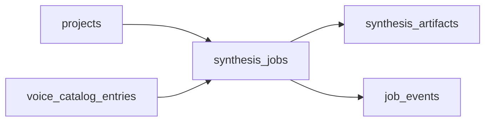

# Database schema

## ERD

## Tables

### `projects`
Project là lớp tổ chức trung tâm.

**Fields chính**
- `project_key` unique
- `name`
- `description`
- `status` (`active` / `archived`)
- `default_provider_key`
- `default_output_format`
- `tags` JSON
- `settings` JSON
- `is_default`
- `archived_at`

### `voice_catalog_entries`
Snapshot catalog đã chuẩn hóa từ nhiều providers.

### `synthesis_jobs`
Đơn vị orchestration chính.

### `synthesis_artifacts`
Metadata cho audio output.

### `job_events`
Timeline event cho observability và SSE snapshots.

### `generation_cache`
Lookup cache để reuse artifact cho cùng provider + voice + text + params.

## Tại sao project schema như vậy

Cơ chế quản lý project được thiết kế để sau này hỗ trợ:
- nhiều workflow khác nhau trong cùng một system
- defaults theo project
- analytics theo project
- routing/fallback theo project
- workspace/team mode

Thay vì chỉ có `project_key`, current schema đã để sẵn chỗ cho:
- lifecycle
- classification
- default generation policy
- extensibility qua `settings`

## Index strategy

### Projects
- `project_key`
- `status`

### Catalog
- `provider_key`
- `display_name`
- `language`
- `locale`

### Jobs
- `external_job_id`
- `project_id`
- `provider_key`
- `provider_voice_id`
- `status`
- `cache_key`

### Artifacts / cache
- `sha256_hex`
- `cache_key`
- `text_hash`
- `params_hash`

### `app_settings`
Stores local/self-host configuration that should survive restarts.

**Fields chính**
- `namespace`
- `key`
- `value_json`
- `is_secret`
- timestamps

**Current namespaces**
- `provider_credentials`
- `merge_defaults`

Secrets are masked in API responses. For production or public/shared deployments, environment variables or an external secret manager should remain the preferred mechanism.
