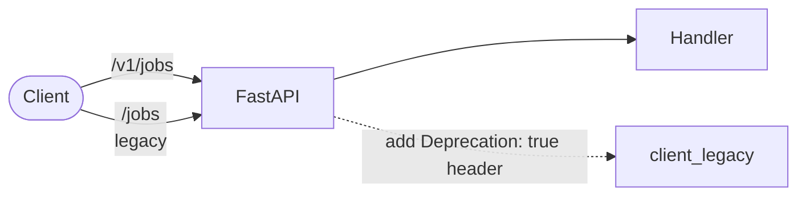

# HTTP API

> **For AI agents:** the public contract is **`/v1/*`**. The legacy un-versioned routes still respond but emit a `Deprecation: true` header — do not point new code at them.
>
> **For humans:** versioning, auth, rate limit, the real-time SSE channel, and the most-used endpoints. Full machine-readable spec is at `/docs` (Swagger) and `/openapi.json`.

## TL;DR

- Base path: `/v1`. Legacy paths (`/jobs`, `/projects`, `/catalog/...`) still work but are deprecated.
- Auth: `X-API-Key: <one-of-APP_API_KEYS>`. Empty `APP_API_KEYS` disables auth (single-user local mode).
- Rate limit: token-bucket per client. 429 with `Retry-After`. `RATE_LIMIT_PER_MINUTE=0` disables.
- Real-time updates: `GET /v1/events/stream` (Server-Sent Events).
- Metrics: `GET /metrics` (Prometheus exposition; unauthenticated by design).

## Versioning



- All new endpoints land under `/v1`. The legacy mounts share handlers — they're aliases, not parallel implementations.
- Breaking changes get a new prefix (`/v2`) when needed; `/v1` will keep working through one full deprecation cycle.

## Authentication

Set `APP_API_KEYS` to a CSV of strong random keys. Clients send `X-API-Key: <key>`. SSE clients that can't set headers (browser EventSource) can use `?api_key=<key>` on the URL.

```
$ curl -H "X-API-Key: $KEY" https://api.example.com/v1/health
```

When `APP_API_KEYS` is empty, the dependency is a no-op — the API is open. This is fine for a single-user local install but should never reach the public internet.

## Rate limit

Token-bucket per discriminator:

- Discriminator = `X-API-Key` value when it matches an entry in `APP_API_KEYS`; otherwise the client's IP.
- Capacity = `RATE_LIMIT_PER_MINUTE` tokens; refills linearly.
- Exceeded → `429 Too Many Requests` with `Retry-After: <seconds>`.
- `RATE_LIMIT_PER_MINUTE=0` disables.

The discriminator-from-API-key gate prevents an untrusted caller from rotating arbitrary `X-API-Key` strings to rent fresh quotas.

## Real-time updates (SSE)

```
GET /v1/events/stream
```

The first event is always a `snapshot` of jobs + projects + recent events. Subsequent events are either a fresh `snapshot` (when state changed) or a `heartbeat` (every `EVENT_STREAM_HEARTBEAT_SECONDS`).

```
event: snapshot
data: {"jobs": [...], "projects": [...], "events": [...]}

event: heartbeat
data: {}
```

The signature/snapshot ordering inside the API is deliberate — see [`architecture.md`](architecture.md#sse-strategy). Clients should always trust the latest `snapshot` payload over their accumulated state.

## Endpoints (high-level)

Full reference at `/docs`. Below is the operator's mental model.

### Jobs

| Method | Path | Notes |
|---|---|---|
| `POST` | `/v1/jobs` | Create + enqueue. Returns `id` and `status=queued`. |
| `GET` | `/v1/jobs` | Paginated list. Query: `limit`, `offset`, `status`, `provider_key`, `project_key`, `q`. |
| `GET` | `/v1/jobs/{id}` | Job detail with artifacts and recent events. |
| `POST` | `/v1/jobs/{id}/cancel` | Allowed while `queued`/`running`. Worker re-checks before each terminal write. |
| `POST` | `/v1/jobs/{id}/retry` | Re-enqueues a `failed`/`canceled` job using the original input. |

### Projects

| Method | Path | Notes |
|---|---|---|
| `GET` | `/v1/projects` | List with stats. |
| `POST` | `/v1/projects` | Create. |
| `GET` | `/v1/projects/{key}` | Detail. |
| `PATCH` | `/v1/projects/{key}` | Update name / description / defaults / tags. |
| `POST` | `/v1/projects/{key}/archive` | Archive (soft delete; jobs retained). |
| `GET` | `/v1/projects/{key}/rows` | Script Editor rows. |
| `PUT` | `/v1/projects/{key}/rows` | Replace rows in bulk. |
| `POST` | `/v1/projects/{key}/queue-rows` | Enqueue jobs for selected rows. |
| `POST` | `/v1/projects/{key}/merge` | Build the master audio from completed rows. |

### Catalog

| Method | Path | Notes |
|---|---|---|
| `GET` | `/v1/catalog/voices` | All providers' voices, paginated. |
| `GET` | `/v1/catalog/voices/search` | Server-side search by query, language, locale. |
| `POST` | `/v1/catalog/refresh` | Trigger a catalog refresh in the background. |

### Settings

| Method | Path | Notes |
|---|---|---|
| `GET` | `/v1/settings/{namespace}` | Read settings. Secrets are masked. |
| `PUT` | `/v1/settings/{namespace}/{key}` | Upsert. Encrypts when `is_secret=true` and `APP_ENCRYPTION_KEY` is set. |
| `GET` | `/v1/settings/schemas` | Per-provider parameter schemas. |

### Health and monitor

| Method | Path | Notes |
|---|---|---|
| `GET` | `/health` | Liveness/readiness. Includes provider reachability. **Unauthenticated.** |
| `GET` | `/v1/monitor/status` | Aggregated provider health + active job counts. |
| `GET` | `/v1/monitor/logs?source=api\|worker\|<engine>` | Tail logs. Engine sources only available when the Docker socket is mounted. |
| `GET` | `/metrics` | Prometheus exposition. Unauthenticated; restrict at the proxy. |

## Error envelope

All errors return JSON:

```json
{
  "detail": "Job not found",
  "code": "job_not_found"
}
```

`detail` is human-readable; `code` is machine-readable and stable across versions.

## Idempotency

`POST /v1/jobs` accepts an optional `external_job_id` header. The API uses it to deduplicate retries — sending the same `external_job_id` twice returns the existing job rather than creating a new one. Useful when integrating with at-least-once webhook delivery.
