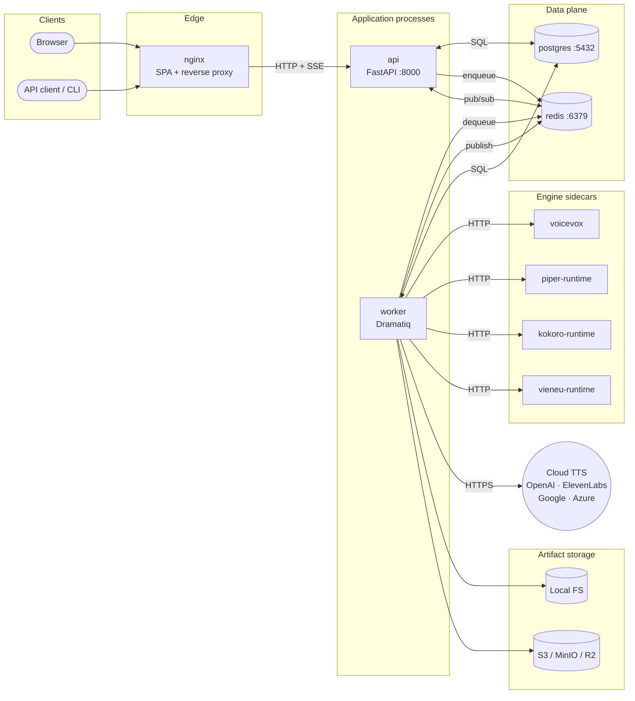
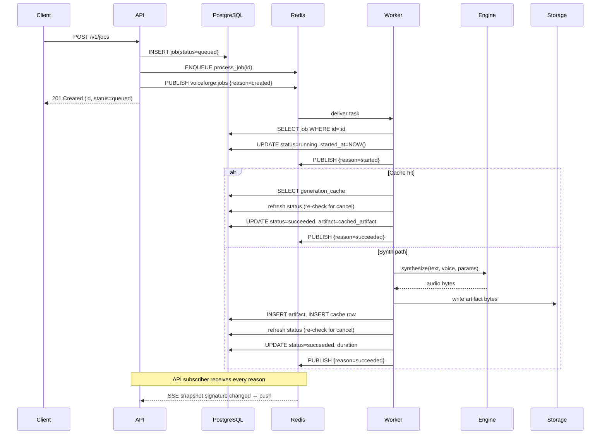
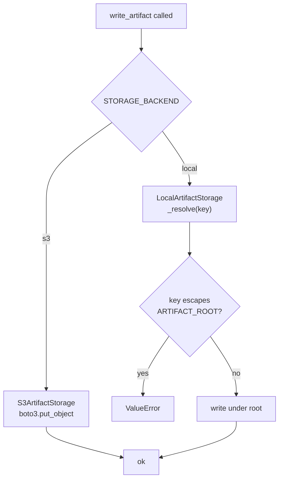
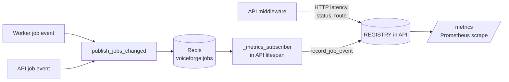

# Architecture

> **For AI agents:** the high-level invariants you must respect when changing code. Read this before editing anything that crosses process boundaries (API ↔ worker), schemas, or external engines.
>
> **For humans:** the system topology, why each piece exists, and the lifecycle of a synthesis job.

## TL;DR

- Five long-lived processes: **api**, **worker**, **postgres**, **redis**, **frontend**. Optional engine sidecars (**voicevox**, **piper-runtime**, **kokoro-runtime**, **vieneu-runtime**) attach via Compose overlays.
- **PostgreSQL** holds all durable state (jobs, projects, voice catalog, artifacts metadata, app settings).
- **Redis** carries two things: the Dramatiq job queue and a `voiceforge:jobs` pub/sub channel that fans out state changes for SSE and metrics.
- The **API** is the only Prometheus exposer. Worker-side state changes reach the API's metrics registry through the Redis subscriber loop.
- **Storage** is pluggable: local filesystem by default; S3-compatible (S3, MinIO, Cloudflare R2) when `STORAGE_BACKEND=s3`.

## System topology



## Job lifecycle



## Process boundaries: what they share and don't

| Resource | API | Worker | Notes |
|---|---|---|---|
| PostgreSQL connection pool | yes | yes | independent pools; transactions don't see uncommitted peers |
| Redis connection | yes | yes | both publish; only API subscribes for metrics + SSE |
| Prometheus `REGISTRY` | yes (exposed on `/metrics`) | yes (never scraped) | **never** record metrics in the worker — they vanish |
| In-memory rate-limit buckets | yes | n/a | rate limit only meaningful in front of HTTP |
| Module-level catalog cache | yes | yes (independent) | refreshed in API only; worker re-reads from DB |
| Artifact filesystem | when `STORAGE_BACKEND=local` | when `STORAGE_BACKEND=local` | both must mount the same volume |

## Layers in `backend/src/voiceforge/`

```
main.py                 FastAPI app, lifespan, middleware, /metrics
api_router.py           builds /v1 + legacy un-versioned router
routes_jobs.py          POST/GET/cancel/retry job endpoints
routes_events.py        SSE endpoints
routes_health.py        /health, /version
schemas.py              Pydantic v2 input/output models
models.py               SQLAlchemy ORM
enums.py                JobStatus, ArtifactKind, ...
db.py                   engine, SessionLocal, init_db
config.py               settings (pydantic-settings)
events_bus.py           Redis pub/sub helpers
observability.py        Prometheus counters / gauges / histograms
rate_limit.py           token-bucket middleware
security/api_key.py     X-API-Key gate dependency
security/encryption.py  Fernet wrap/unwrap for app_settings secrets
services/storage.py     ArtifactStorage Protocol + Local + S3 backends
services_jobs.py        process_job, cancel_job, retry_job, reap_stale_jobs
services_catalog.py     refresh_catalog, voice search
services_app_settings.py per-namespace settings (provider creds, merge defaults)
services_projects.py    project CRUD + ensure_project bootstrap
tasks.py                Dramatiq actor that calls process_job
providers/              cloud + OSS adapters (one file per provider)
```

## Why a separate worker process

- **Dependency isolation.** Cloud SDKs (Google, Azure) and OSS engine SDKs pull large native dependencies. Keeping them out of the API container shrinks its image and startup time.
- **Failure isolation.** A misbehaving provider can hang an HTTP call indefinitely; that's contained inside the worker.
- **Scale shape.** Synthesis is CPU-bound (OSS engines) or latency-bound (cloud). Scaling the worker horizontally is independent of API request load.

## Why a separate engine sidecar per OSS engine

- Each engine has its own Python dependency graph (Piper requires `piper-tts`, Kokoro requires `kokoro` + `torch`, VieNeu uses its own SDK). Mixing them in one container creates pin conflicts.
- Each engine has its own model-download lifecycle (Piper downloads voice files; Kokoro downloads weights from HuggingFace).
- A Compose overlay turns each on/off independently.

## SSE strategy

- The browser opens `GET /v1/events/stream` and gets a **snapshot** event immediately.
- The server then waits on the Redis pub/sub channel `voiceforge:jobs`. Each message carries a `reason` (`created`/`started`/`succeeded`/`failed`/`canceled`/`retried`/`reaped_failed`) and an optional payload.
- A heartbeat fires every `EVENT_STREAM_HEARTBEAT_SECONDS` (15s default). If the snapshot signature hasn't changed since the last push, only `event: heartbeat` is sent — the browser doesn't reconcile.
- The `_snapshot_with_signature()` helper reads the signature **first** in the same DB session as the snapshot, guaranteeing the client never receives a snapshot whose signature is ahead of its data.

## Cancellation and concurrent state

`cancel_job` runs in the API process and commits `status=canceled` independently of `process_job` running in the worker. Without coordination, the worker can overwrite `canceled` with a stale `succeeded`/`failed`. The fix:

- `services_jobs._was_canceled_concurrently(db, job)` calls `db.refresh(job, attribute_names=["status"])` to observe the API commit (Read Committed isolation suffices).
- The worker calls it before each terminal write: cache-hit success, synth success, synth failure.

## Storage backend selection



## Observability



The single-subscriber design is critical: every job state transition — regardless of which process originated it — flows through the API's `REGISTRY`. The in-flight gauge is seeded from the database at startup and clamped to `≥ 0` so a process restart can never produce a negative reading.

## Configuration surface

All configuration is environment-driven. See [`self-hosting.md`](self-hosting.md) for the full env var reference. The `config.py` module loads settings via pydantic-settings; defaults are conservative for a single-user local install.

## Decisions deliberately deferred

These are intentional gaps; see [`feature-map.md`](feature-map.md) for status:

- **Multi-user auth.** Currently a shared `APP_API_KEYS` CSV gates the API; there is no user model or workspace isolation.
- **Worker scaling.** Dramatiq supports multiple worker replicas, but priority queues, dead-letter handling, and per-project concurrency caps are not yet implemented.
- **Telemetry.** No anonymous usage stats are collected.
