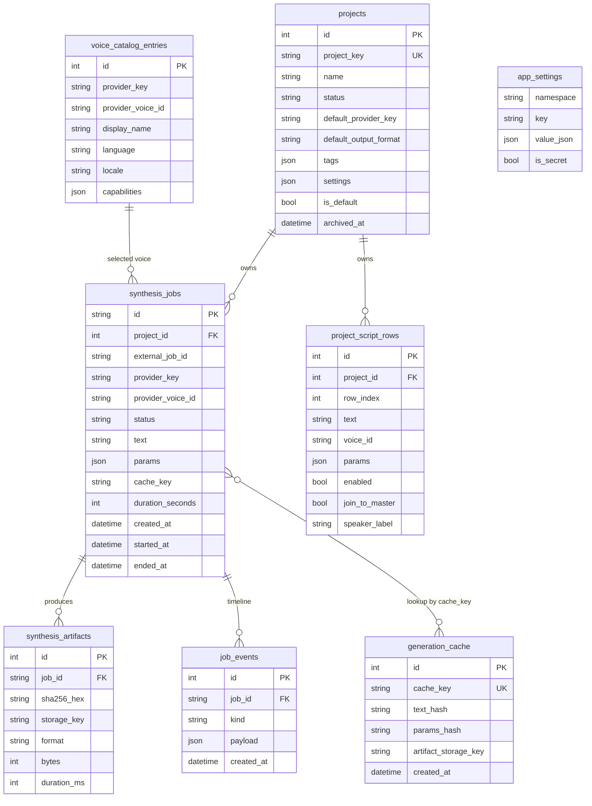

# Database

> **For AI agents:** every schema change goes through Alembic. **Never** edit a committed revision; add a new one. Run `make migrate-status` before assuming a column exists in a deployed database.
>
> **For humans:** ERD, table reference, and migration discipline.

## TL;DR

- One PostgreSQL database holds all durable state: projects, jobs, voice catalog, artifacts, events, generation cache, app settings, project script rows.
- Alembic owns the schema in production (`db.init_db()` only calls `create_all` in `development`/`test`).
- Foreign keys are enforced; `ON DELETE` is set to `CASCADE` for parent→child where appropriate (jobs → events, jobs → artifacts).

## ERD

## Tables

### `projects`

The organizational unit. Every job belongs to a project; switching engine/voice doesn't break that grouping.

Key columns:
- `project_key` — stable string identifier used in URLs and API.
- `status` — `active` / `archived`.
- `default_provider_key`, `default_output_format` — defaults applied when creating new jobs from this project.
- `tags`, `settings` — extensibility JSON.
- `is_default` — exactly one project is bootstrapped at install time as the default.
- `archived_at` — non-null when archived; archived projects are hidden from default listings.

### `synthesis_jobs`

The orchestration unit.

Key columns:
- `id` — string UUID; this is what clients see.
- `project_id` — FK to `projects`.
- `provider_key`, `provider_voice_id` — selected engine + voice.
- `status` — one of `JobStatus`: `queued`, `running`, `succeeded`, `failed`, `canceled`.
- `text` — input text. Stored as-is; never logged.
- `params` — JSON of provider-specific parameters.
- `cache_key` — derived from `(provider_key, voice_id, text_hash, params_hash, output_format)`. Hits skip synthesis.
- `duration_seconds` — populated on success.

Indexes: `external_job_id`, `project_id`, `provider_key`, `provider_voice_id`, `status`, `cache_key`.

### `synthesis_artifacts`

Audio file metadata. The bytes themselves live in artifact storage (local FS or S3); the `storage_key` is the lookup.

### `job_events`

Append-only timeline of state transitions for a job. Used by the SSE snapshot and the in-app job detail panel.

### `voice_catalog_entries`

Snapshot of voices reported by each provider. Refreshed on API startup (background task) and on demand via `/v1/catalog/refresh`.

Indexes: `provider_key`, `display_name`, `language`, `locale`.

### `generation_cache`

Lookup table that lets two identical jobs (same text, voice, params, output format) share an artifact. Avoids paying for the same synthesis twice.

### `project_script_rows`

Per-project ordered rows for the Script Editor workflow. Each row has its own text, optional per-row voice/provider override, params, enable flag, join-to-master flag, and an optional `speaker_label` (free-text dialogue tag, max 80 chars; added in alembic `20260424_0004`). The label is consumed by `services_subtitles.py` to prefix subtitle cues with `[Speaker]`.

Indexes: `project_id`, `row_index`.

### `app_settings`

Local self-host configuration that should survive restarts. Stored as JSON for forward compatibility.

Key columns:
- `namespace` — group of related settings (`provider_credentials`, `merge_defaults`, ...).
- `key` — the setting name within the namespace.
- `value_json` — payload. Encrypted with Fernet when `is_secret=true` and `APP_ENCRYPTION_KEY` is set.
- `is_secret` — when true, API responses mask the value (return `"***"` instead of plaintext).

Environment variables take precedence over `app_settings` rows of the same logical name. The DB-stored values are convenient for UI-driven local setup; production deployments should put credentials in env vars.

## Index strategy

Indexes follow the read patterns:

- **Listing jobs**: `(project_id, status, created_at DESC)` is the common query. Indexes on `project_id`, `status`, and the implicit `created_at` order serve it.
- **Cache lookup**: `cache_key` is a unique index — exact match, fast.
- **Voice browser**: `provider_key + locale` covers the common filter.
- **Catalog refresh**: `(provider_key, provider_voice_id)` is unique to allow upsert.

## Migration discipline

1. Edit `backend/src/voiceforge/models.py`.
2. Run `make migrate-autogenerate m="<imperative summary>"`.
3. Open the generated file under `backend/alembic/versions/` — confirm the diff is what you expected. Pay attention to:
   - Implicit drops Alembic decided to keep (good) vs drops you actually want (rare; usually wrong).
   - Index renames vs drop+create.
   - Server-side defaults — Alembic doesn't always notice them.
4. Run `make migrate` locally; reverse with `make migrate-down` to confirm round-trip.
5. Commit. CI runs `make migrate` against a clean database in the pipeline.

If you need raw SQL or a data migration: `make migrate-revision m="..."` for an empty file, then write `op.execute(...)` blocks. Keep data migrations small and idempotent.
