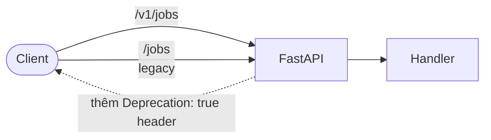

# HTTP API

> **Dành cho AI agent:** public contract là **`/v1/*`**. Route legacy không version vẫn trả lời nhưng emit header `Deprecation: true` — không nên cho code mới trỏ vào đó.
>
> **Dành cho người đọc:** versioning, auth, rate limit, channel SSE thời gian thực, và các endpoint thông dụng nhất. Spec đầy đủ ở `/docs` (Swagger) và `/openapi.json`.

## TL;DR

- Base path: `/v1`. Path legacy (`/jobs`, `/projects`, `/catalog/...`) vẫn hoạt động nhưng deprecated.
- Auth: `X-API-Key: <one-of-APP_API_KEYS>`. `APP_API_KEYS` rỗng = tắt auth (mode single-user local).
- Rate limit: token-bucket per client. 429 với `Retry-After`. `RATE_LIMIT_PER_MINUTE=0` = tắt.
- Update thời gian thực: `GET /v1/events/stream` (Server-Sent Events).
- Metrics: `GET /metrics` (Prometheus exposition; không auth theo thiết kế).

## Versioning



- Tất cả endpoint mới đặt dưới `/v1`. Mount legacy chia sẻ handler — chỉ là alias, không phải implementation song song.
- Breaking change tạo prefix mới (`/v2`) khi cần; `/v1` tiếp tục hoạt động qua một chu kỳ deprecation.

## Authentication

Đặt `APP_API_KEYS` là CSV các key random mạnh. Client gửi `X-API-Key: <key>`. SSE client không set được header (browser EventSource) dùng `?api_key=<key>` trên URL.

```
$ curl -H "X-API-Key: $KEY" https://api.example.com/v1/health
```

Khi `APP_API_KEYS` rỗng, dependency là no-op — API mở. Phù hợp single-user local nhưng không bao giờ nên phơi ra Internet.

## Rate limit

Token bucket per discriminator:

- Discriminator = giá trị `X-API-Key` khi nó match một entry trong `APP_API_KEYS`; ngược lại là IP client.
- Capacity = `RATE_LIMIT_PER_MINUTE` token; refill linear.
- Vượt quota → `429 Too Many Requests` với `Retry-After: <seconds>`.
- `RATE_LIMIT_PER_MINUTE=0` = tắt.

Cơ chế discriminator-từ-API-key chặn caller untrusted xoay vòng `X-API-Key` bừa để rent quota mới.

## Update thời gian thực (SSE)

```
GET /v1/events/stream
```

Event đầu tiên luôn là `snapshot` của job + project + event gần đây. Event sau là `snapshot` mới (khi state đổi) hoặc `heartbeat` (mỗi `EVENT_STREAM_HEARTBEAT_SECONDS`).

```
event: snapshot
data: {"jobs": [...], "projects": [...], "events": [...]}

event: heartbeat
data: {}
```

Thứ tự signature/snapshot trong API là cố ý — xem [`architecture.md`](architecture.md#chi%E1%BA%BFn-l%C6%B0%E1%BB%A3c-sse). Client nên tin payload `snapshot` mới nhất hơn state đã tích lũy của mình.

## Endpoint (mức cao)

Reference đầy đủ ở `/docs`. Dưới đây là model nhận thức dành cho operator.

### Job

| Method | Path | Ghi chú |
|---|---|---|
| `POST` | `/v1/jobs` | Tạo + enqueue. Trả `id` và `status=queued`. |
| `GET` | `/v1/jobs` | List có phân trang. Query: `limit`, `offset`, `status`, `provider_key`, `project_key`, `q`. |
| `GET` | `/v1/jobs/{id}` | Detail kèm artifact và event gần đây. |
| `GET` | `/v1/jobs/{id}/artifact` | Stream file audio. |
| `POST` | `/v1/jobs/{id}/cancel` | Cho phép khi `queued`/`running`. Worker re-check trước mỗi terminal write. |
| `POST` | `/v1/jobs/{id}/retry` | Re-enqueue job `failed`/`canceled` với input gốc. |

### Project

| Method | Path | Ghi chú |
|---|---|---|
| `GET` | `/v1/projects` | List với stats. |
| `POST` | `/v1/projects` | Tạo. |
| `GET` | `/v1/projects/{key}` | Detail. |
| `PATCH` | `/v1/projects/{key}` | Update name / description / default / tag / cờ archive. |
| `GET` | `/v1/projects/{key}/merged-artifact` | Stream bản master mix-down của project. |
| `GET` | `/v1/projects/{key}/export.zip` | T1.5 — tải bundle project (audio + script + voice-map + file gốc). |

### Project script row

Tất cả route mount dưới `/v1/projects/{key}/rows`.

| Method | Path | Ghi chú |
|---|---|---|
| `GET` | `/v1/projects/{key}/rows` | Row Script Editor theo thứ tự hiển thị. |
| `PUT` | `/v1/projects/{key}/rows` | Replace row hàng loạt (Script Editor save). |
| `POST` | `/v1/projects/{key}/rows/queue` | Enqueue job cho row đã chọn (trước là `/queue-rows`). |
| `POST` | `/v1/projects/{key}/rows/merge` | Build master audio từ các row đã hoàn thành (trước là `/merge`). |
| `POST` | `/v1/projects/{key}/rows/bulk` | T1.1 — bulk import từ `multipart/form-data` (`file=*.txt\|*.csv`). |
| `GET` | `/v1/projects/{key}/rows/artifacts.zip` | T1.1 — tải toàn bộ artifact các row đã hoàn thành dưới dạng zip. |
| `GET` | `/v1/projects/{key}/rows/subtitles` | T1.3 — tải `.srt` hoặc `.vtt` cho project. Query: `format=srt\|vtt`, `silence_ms`, `only_completed`. |
| `GET` | `/v1/projects/{key}/rows/{row_id}/artifact` | Stream audio của 1 row. |

### Catalog

| Method | Path | Ghi chú |
|---|---|---|
| `GET` | `/v1/catalog/voices` | Voice mọi provider, có phân trang. |
| `GET` | `/v1/catalog/voices/search` | Search server-side theo query, language, locale. |

### Provider

| Method | Path | Ghi chú |
|---|---|---|
| `GET` | `/v1/providers` | Tóm tắt provider (status, voice sẵn, capability). |
| `GET` | `/v1/providers/{key}/voices` | Voice của 1 provider. |
| `GET` | `/v1/providers/{key}/voices/{voice_id}/preview` | Stream sample voice từ catalog. |
| `POST` | `/v1/providers/{key}/preview` | T1.4 — synthesize 1 đoạn text ad-hoc, không enqueue job. |

### Settings

| Method | Path | Ghi chú |
|---|---|---|
| `GET` | `/v1/settings` | Tổng quan: credential redact, schema voice-parameter, merge default. |
| `GET` | `/v1/settings/provider-credentials` | List credential provider đã redact. |
| `PUT` | `/v1/settings/provider-credentials/{provider_key}` | Upsert. Encrypt bằng Fernet khi `APP_ENCRYPTION_KEY` set. |
| `GET` | `/v1/settings/voice-parameter-schemas` | Schema tham số của mọi provider. |
| `GET` | `/v1/settings/voice-parameter-schemas/{provider_key}` | Schema của 1 provider. |
| `PATCH` | `/v1/settings/merge-defaults` | Cập nhật default merge format/silence/... |

### System và admin

| Method | Path | Ghi chú |
|---|---|---|
| `GET` | `/v1/system/capabilities` | T2.6 — host probe (CPU count, GPU presence, NVML data, memory). |
| `GET` | `/v1/admin/retention/preview` | T3.10 — dry-run: purge sẽ xóa bao nhiêu job/artifact. |
| `POST` | `/v1/admin/retention/purge` | T3.10 — thực sự xóa job cũ hơn threshold. |

### Real-time và event

| Method | Path | Ghi chú |
|---|---|---|
| `GET` | `/v1/events/snapshot` | Snapshot 1-lần state hiện tại (jobs + projects + event gần đây). |
| `GET` | `/v1/events/stream` | Stream Server-Sent Events (snapshot + heartbeat). |

### Health và monitor

| Method | Path | Ghi chú |
|---|---|---|
| `GET` | `/health` | Liveness/readiness. Bao gồm reachability provider. **Không auth.** |
| `GET` | `/v1/monitor/status` | Health provider tổng + số job đang chạy. |
| `GET` | `/v1/monitor/log-sources` | Danh sách log source khả dụng. |
| `GET` | `/v1/monitor/logs?source=api\|worker\|<engine>` | Tail log. Source engine chỉ khả dụng khi mount Docker socket. |
| `GET` | `/metrics` | Prometheus exposition. Không auth; restrict ở proxy. |

## Error envelope

Mọi lỗi trả JSON:

```json
{
  "detail": "Job not found",
  "code": "job_not_found"
}
```

`detail` cho người đọc; `code` ổn định qua các version, dành cho code xử lý.

## Idempotency

`POST /v1/jobs` chấp nhận header `external_job_id` tùy chọn. API dùng nó để dedup retry — gửi cùng `external_job_id` hai lần trả job đã có thay vì tạo mới. Tiện cho integrate với webhook delivery at-least-once.
