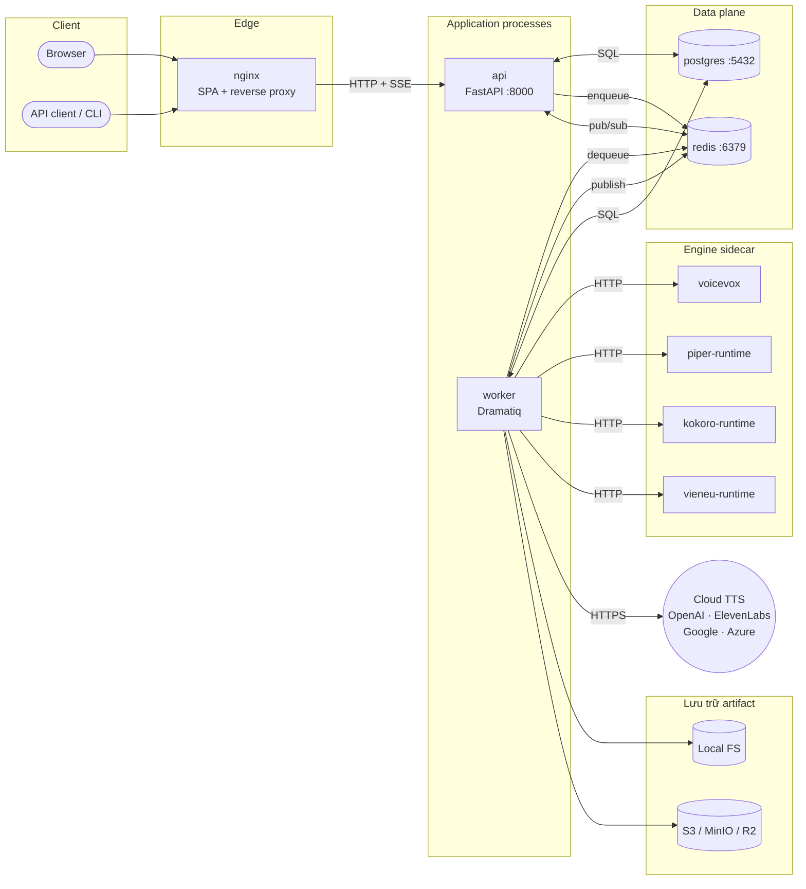
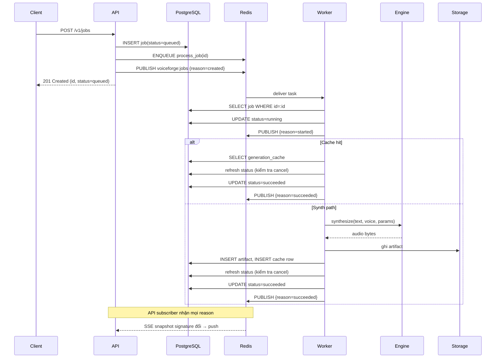
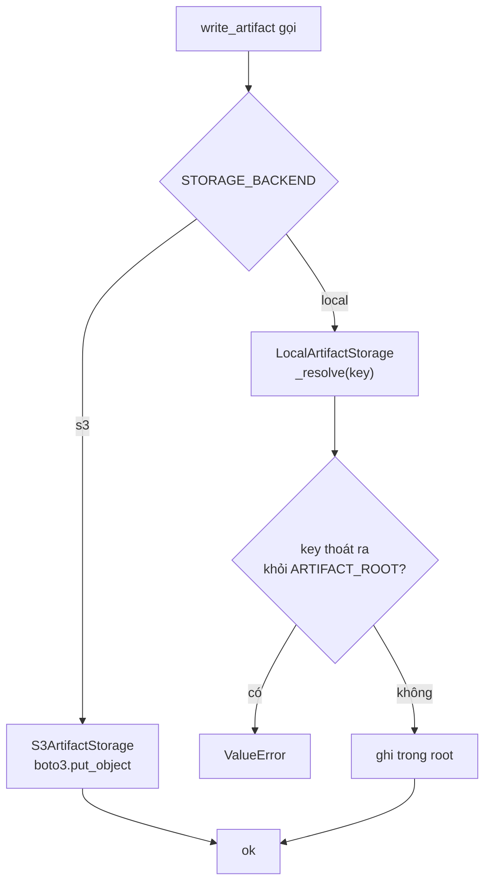
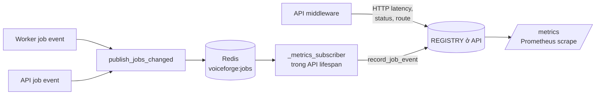

# Kiến trúc

> **Dành cho AI agent:** đây là các bất biến cần tôn trọng khi sửa code. Đọc trước khi chỉnh bất cứ thứ gì đi qua biên giới process (API ↔ worker), schema, hoặc engine bên ngoài.
>
> **Dành cho người đọc:** topology hệ thống, vai trò từng thành phần, và vòng đời của một job synthesis.

## TL;DR

- Năm process chạy dài: **api**, **worker**, **postgres**, **redis**, **frontend**. Các engine sidecar (**voicevox**, **piper-runtime**, **kokoro-runtime**, **vieneu-runtime**) bật/tắt qua Compose overlay.
- **PostgreSQL** giữ toàn bộ state bền (job, project, voice catalog, artifact metadata, app settings).
- **Redis** chở hai thứ: queue Dramatiq và channel pub/sub `voiceforge:jobs` để fan out state changes cho SSE và metrics.
- Chỉ **API** export Prometheus. Mọi thay đổi state từ worker đến được REGISTRY của API thông qua subscriber loop trên Redis.
- **Storage** plug được: local filesystem mặc định; S3-compatible (S3, MinIO, Cloudflare R2) khi `STORAGE_BACKEND=s3`.

## Topology



## Vòng đời job



## Biên giới process: chia sẻ và không chia sẻ

| Tài nguyên | API | Worker | Ghi chú |
|---|---|---|---|
| Pool kết nối PostgreSQL | có | có | pool độc lập; transaction không thấy commit chưa được commit của bên khác |
| Kết nối Redis | có | có | cả hai publish; chỉ API subscribe cho metrics + SSE |
| Prometheus `REGISTRY` | có (expose `/metrics`) | có (không bao giờ scrape) | **không bao giờ** record metric ở worker — sẽ biến mất |
| In-memory rate-limit bucket | có | n/a | rate limit chỉ có nghĩa trước HTTP |
| Cache catalog ở module level | có | có (độc lập) | refresh chỉ ở API; worker đọc lại từ DB |
| Filesystem artifact | khi `STORAGE_BACKEND=local` | khi `STORAGE_BACKEND=local` | cả hai phải mount cùng volume |

## Cấu trúc `backend/src/voiceforge/`

```
main.py                 FastAPI app, lifespan, middleware, /metrics
api_router.py           build router /v1 + alias legacy
routes_jobs.py          POST/GET/cancel/retry job
routes_events.py        SSE
routes_health.py        /health, /version
schemas.py              Pydantic v2 input/output
models.py               SQLAlchemy ORM
enums.py                JobStatus, ArtifactKind, ...
db.py                   engine, SessionLocal, init_db
config.py               settings (pydantic-settings)
events_bus.py           helper Redis pub/sub
observability.py        Prometheus counters / gauges / histograms
rate_limit.py           middleware token-bucket
security/api_key.py     dependency check X-API-Key
security/encryption.py  Fernet wrap/unwrap cho secret
services/storage.py     ArtifactStorage Protocol + Local + S3
services_jobs.py        process_job, cancel_job, retry_job, reap_stale_jobs
services_catalog.py     refresh_catalog, voice search
services_app_settings.py settings theo namespace
services_projects.py    project CRUD + ensure_project
tasks.py                actor Dramatiq gọi process_job
providers/              adapter cloud + OSS
```

## Vì sao tách worker process

- **Cô lập dependency.** SDK cloud (Google, Azure) và SDK OSS engine kéo theo nhiều native dependency. Giữ chúng ngoài API container giảm kích thước image và thời gian khởi động.
- **Cô lập lỗi.** Một provider treo HTTP call vô hạn — vấn đề đó nằm trong worker, không kéo API down.
- **Hình thái scale.** Synthesis là CPU-bound (OSS) hoặc latency-bound (cloud). Scale worker theo chiều ngang độc lập với API request load.

## Vì sao mỗi OSS engine một sidecar riêng

- Mỗi engine có dependency graph Python riêng (Piper cần `piper-tts`, Kokoro cần `kokoro` + `torch`, VieNeu dùng SDK riêng). Trộn lại tạo xung đột pin.
- Mỗi engine có lifecycle download model riêng (Piper tải voice, Kokoro tải weights HuggingFace).
- Compose overlay bật/tắt từng engine độc lập.

## Chiến lược SSE

- Browser mở `GET /v1/events/stream` và nhận event `snapshot` ngay lập tức.
- Server chờ pub/sub Redis trên channel `voiceforge:jobs`. Mỗi message mang `reason` (`created`/`started`/`succeeded`/`failed`/`canceled`/`retried`/`reaped_failed`) và payload tùy chọn.
- Heartbeat phát mỗi `EVENT_STREAM_HEARTBEAT_SECONDS` (mặc định 15s). Nếu signature snapshot không đổi từ lần push trước, chỉ gửi `event: heartbeat` — browser không phải reconcile.
- Hàm `_snapshot_with_signature()` đọc signature **trước** rồi đọc snapshot trong cùng một DB session, đảm bảo client không nhận được snapshot có signature đi trước data.

## Hủy job và state đồng thời

`cancel_job` chạy trong process API và commit `status=canceled` độc lập với `process_job` đang chạy ở worker. Không có cơ chế phối hợp, worker có thể overwrite `canceled` bằng `succeeded`/`failed` cũ. Cách xử lý:

- `services_jobs._was_canceled_concurrently(db, job)` gọi `db.refresh(job, attribute_names=["status"])` để thấy commit của API (Read Committed isolation đủ).
- Worker gọi nó trước mỗi terminal write: cache-hit success, synth success, synth failure.

## Chọn storage backend



## Observability



Thiết kế single-subscriber là then chốt: mọi state transition — bất kể process nào phát sinh — đều đi qua REGISTRY của API. Gauge in-flight được seed từ database lúc startup và clamp `≥ 0` để khởi động lại không bao giờ ra số âm.

## Mặt cấu hình

Toàn bộ cấu hình điều khiển bằng biến môi trường. Tham khảo [`self-hosting.md`](self-hosting.md) cho danh sách đầy đủ. Module `config.py` load qua pydantic-settings; default giữ ở mức an toàn cho cài đặt single-user local.

## Các quyết định chủ động trì hoãn

Đây là khoảng trống cố ý; xem [`feature-map.md`](feature-map.md) để biết trạng thái:

- **Auth multi-user.** Hiện một CSV `APP_API_KEYS` chia sẻ chung cho cả API; chưa có model user hay workspace isolation.
- **Worker scaling.** Dramatiq hỗ trợ nhiều replica, nhưng priority queue, dead-letter, và per-project concurrency cap chưa làm.
- **Telemetry.** Không thu thập số liệu sử dụng ẩn danh.
