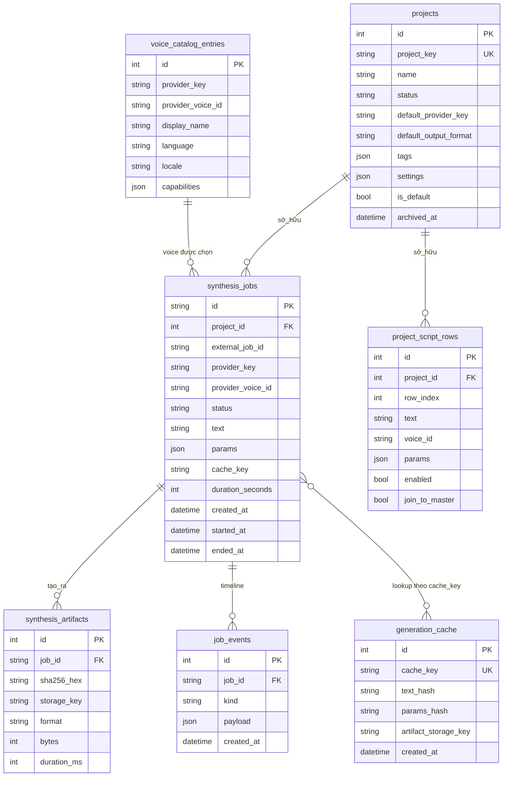

# Database

> **Dành cho AI agent:** mọi schema change đi qua Alembic. **Không bao giờ** sửa revision đã commit; thêm revision mới. Chạy `make migrate-status` trước khi giả định một column tồn tại trong DB đã deploy.
>
> **Dành cho người đọc:** ERD, danh sách bảng, kỷ luật migration.

## TL;DR

- Một database PostgreSQL chứa toàn bộ state bền: project, job, voice catalog, artifact, event, generation cache, app settings, project script row.
- Alembic làm chủ schema ở production (`db.init_db()` chỉ gọi `create_all` ở `development`/`test`).
- Foreign key được enforce; `ON DELETE CASCADE` cho parent→child phù hợp (job → event, job → artifact).

## ERD

## Bảng

### `projects`

Đơn vị tổ chức. Mỗi job thuộc về một project; chuyển engine/voice không làm phân mảnh dữ liệu.

Cột chính:
- `project_key` — định danh ổn định dùng trong URL và API.
- `status` — `active` / `archived`.
- `default_provider_key`, `default_output_format` — default áp dụng khi tạo job mới từ project.
- `tags`, `settings` — JSON mở rộng.
- `is_default` — đúng một project được bootstrap ở install time làm default.
- `archived_at` — non-null khi archive; archive bị ẩn khỏi listing mặc định.

### `synthesis_jobs`

Đơn vị orchestration.

Cột chính:
- `id` — string UUID; client thấy giá trị này.
- `project_id` — FK đến `projects`.
- `provider_key`, `provider_voice_id` — engine + voice được chọn.
- `status` — một trong `JobStatus`: `queued`, `running`, `succeeded`, `failed`, `canceled`.
- `text` — input text. Lưu nguyên; không log.
- `params` — JSON tham số per-provider.
- `cache_key` — derive từ `(provider_key, voice_id, text_hash, params_hash, output_format)`. Hit thì skip synthesis.
- `duration_seconds` — set khi success.

Index: `external_job_id`, `project_id`, `provider_key`, `provider_voice_id`, `status`, `cache_key`.

### `synthesis_artifacts`

Metadata file audio. Bytes nằm ở artifact storage (local FS hoặc S3); `storage_key` là khóa lookup.

### `job_events`

Timeline append-only của state transition cho job. Dùng cho SSE snapshot và panel job detail trong app.

### `voice_catalog_entries`

Snapshot voice mỗi provider report. Refresh ở API startup (background) và on-demand qua `/v1/catalog/refresh`.

Index: `provider_key`, `display_name`, `language`, `locale`.

### `generation_cache`

Bảng lookup để hai job giống nhau (cùng text, voice, params, output format) chia sẻ artifact. Tránh trả tiền synthesis hai lần.

### `project_script_rows`

Row có thứ tự per-project cho workflow Script Editor. Mỗi row có text riêng, override voice/provider tùy chọn, params, cờ enable, cờ join-to-master.

Index: `project_id`, `row_index`.

### `app_settings`

Cấu hình self-host local cần sống qua restart. Lưu JSON cho forward compatibility.

Cột chính:
- `namespace` — nhóm setting liên quan (`provider_credentials`, `merge_defaults`, ...).
- `key` — tên setting trong namespace.
- `value_json` — payload. Encrypt bằng Fernet khi `is_secret=true` và `APP_ENCRYPTION_KEY` set.
- `is_secret` — true thì API response mask giá trị (`"***"` thay plaintext).

Biến môi trường ưu tiên hơn row `app_settings` cùng tên logic. DB-stored thuận tiện cho setup UI local; production nên đặt credential trong env var.

## Chiến lược index

Index theo pattern read:

- **List job**: `(project_id, status, created_at DESC)` là query phổ biến. Index trên `project_id`, `status`, và thứ tự ngầm `created_at` phục vụ query đó.
- **Cache lookup**: `cache_key` unique — exact match, nhanh.
- **Voice browser**: `provider_key + locale` cover filter phổ biến.
- **Catalog refresh**: `(provider_key, provider_voice_id)` unique cho upsert.

## Kỷ luật migration

1. Sửa `backend/src/voiceforge/models.py`.
2. Chạy `make migrate-autogenerate m="<imperative summary>"`.
3. Mở file sinh ra trong `backend/alembic/versions/` — confirm diff đúng. Lưu ý:
   - Drop ngầm Alembic giữ lại (tốt) vs drop bạn thật sự muốn (hiếm; thường sai).
   - Index rename vs drop+create.
   - Server-side default — Alembic không phải lúc nào cũng nhận ra.
4. Chạy `make migrate` local; reverse bằng `make migrate-down` để xác nhận round-trip.
5. Commit. CI chạy `make migrate` trên DB sạch.

Nếu cần raw SQL hoặc data migration: `make migrate-revision m="..."` cho file rỗng, rồi viết block `op.execute(...)`. Giữ data migration nhỏ và idempotent.
